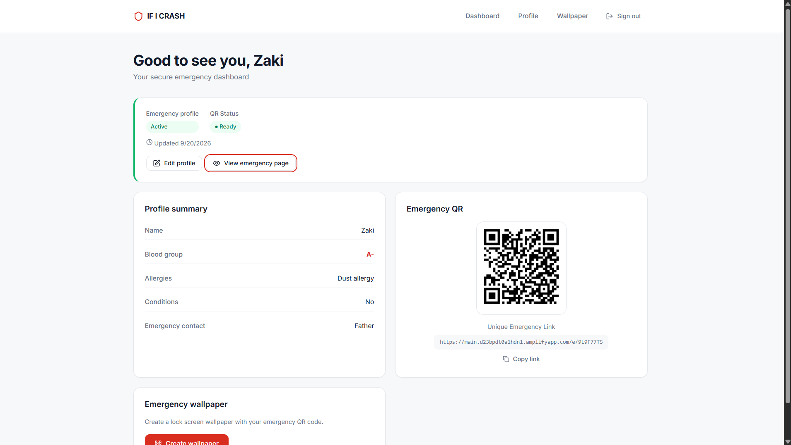

# 🚨 If I Crash

> **Your emergency information, available when it matters most.**

A QR-powered emergency information system designed to make critical personal information quickly accessible during an emergency.

<p align="center">

[](https://main.d23bpdt0a1hdn1.amplifyapp.com/)
[](https://react.dev/)
[](https://vite.dev/)
[](https://aws.amazon.com/amplify/)

</p>

---

## 🌐 Live Application

### 🚀 [Launch If I Crash](https://main.d23bpdt0a1hdn1.amplifyapp.com/)

---

## 💡 About the Project

During an accident or emergency, a person may be unconscious or unable to communicate important personal information.

**If I Crash** provides a digital emergency profile connected to a QR-powered emergency card.

A user can create an account, add important emergency information, generate an emergency card, and use the QR code to provide quick access to selected information when it matters most.

The project was built as a hands-on cloud development project using **React and AWS**.

---

# 📸 Screenshots

## 🏠 Home Page


---

## 🔄 How It Works


---

## 📊 Dashboard



---

## 🆘 Emergency Profile


---

## 🪪 Wallpaper


---

# ✨ Features

- 🔐 **User Authentication**
  - Secure user account and authentication flow.

- 👤 **Emergency Profile**
  - Store important emergency information in one place.

- 🪪 **Digital Emergency Card**
  - Generate a personalized emergency card containing selected emergency information and a QR code.

- 📱 **QR Code Access**
  - A rescuer can scan the QR code to access the available emergency information.

- 🔄 **Profile Updates**
  - Update emergency information whenever required.

- 🎨 **Custom Emergency Card**
  - Personalize the appearance of the emergency card using wallpapers.

- 📱 **Responsive Design**
  - Designed to work across mobile, tablet, and desktop screens.

- ☁️ **Cloud Deployment**
  - Deployed as a live web application using AWS.

---

# 🔄 How It Works

```text
                    USER
                      │
                      ▼
              Create Account
                      │
                      ▼
            Create Emergency Profile
                      │
                      ├── Name
                      ├── Blood Group
                      ├── Emergency Contacts
                      └── Emergency Information
                      │
                      ▼
             Generate Emergency Card
                      │
                      ▼
                  QR Code
                      │
                      ▼
              Rescuer Scans QR
                      │
                      ▼
          Emergency Information
